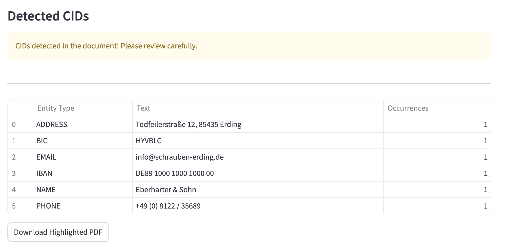

# CID Detection

**General Idea**

Modern AI Models show promising results in detecting sensitive data patterns. While not perfect, they can significantly reduce manual review workload for Client Identifying Data (CID) in documents.

**Core Challenge**

Current Passport invoice processing:
- Time-consuming human verification of documents
- Risk of human error missing sensitive data

**Solution**

The CID Detection Service identifies names of individuals and companies in PDFs. It automates the detection of Client Identifying Data (CID) in invoices to prevent exposure of sensitive information.

## 🌟 Key Features
- Identifies personal/company names, addresses, financial identifiers
- Provides REST API, CLI, and web interface
- Highlights detected CID in documents

## 🛠️ Setup Instructions

### Prerequisites
- Python 3.10+
- Ollama server running (for LLM processing)
```bash
brew install ollama
ollama pull llama2.3
ollama run llama2.3
```
- Docker

### Installation

1. Clone repository
```bash
git clone <your-repo-url>
cd Natalie_Sumbo_Filipe
````

2. Create and activate the virtual environment:
```bash
pyenv install 3.10.6
pyenv virtualenv 3.10.6 cid-detection
pyenv activate cid-detection
```

3. Install dependencies:
```bash
make install
```

## CLI Usage

### REST API & Web Interface
```bash
make run
```
Access at UI: http://localhost:8501

API Docs: http://localhost:8000/docs

### Command Line
In the root folder run
```bash
python -m src.backend.cli data/CID-1.pdf
```

#### 📊 Expected Outputs
```json
{
  "cid_entities": [
    {
      "entity_type": "NAME",
      "text": "Eberharter & Sohn"
    },
    {
      "entity_type": "IBAN",
      "text": "CH93 0076 2011 6238 5295 7"
    }
  ]
}
````

## Docker
### Build
```bash
make docker-build
````

### Run
```
make docker-run
````

#### 📊 Expected Outputs


## Environment Variables

| Variable               | Description                                                                 | Default Value                 |
|------------------------|-----------------------------------------------------------------------------|-------------------------------|
| `ENV_MODE`             | Runtime environment (`docker` or `local`)                                   | `docker`                      |
| `API_HOST_LOCAL`       | API base URL for local development                                          | `http://localhost:8000`       |
| `API_HOST_DOCKER`      | API base URL for Docker containers                                          | `http://backend:8000`         |
| `OLLAMA_HOST_LOCAL`    | Ollama server URL for local development                                     | `http://localhost:11434`      |
| `OLLAMA_HOST_DOCKER`   | Ollama server URL for Docker containers                                     | `http://host.docker.internal:11434` |
| `OLLAMA_MODEL`         | Ollama model for CID detection                                              | `llama3.2:latest`             |

## Development

- Run tests: `make test`
- Run code: `make run`
- Clean build files: `make clean`
- Run formatter and tests: `./autotest.sh`

## Creadits
Author: Natalie Sumbo Filipe

## License

MIT License 